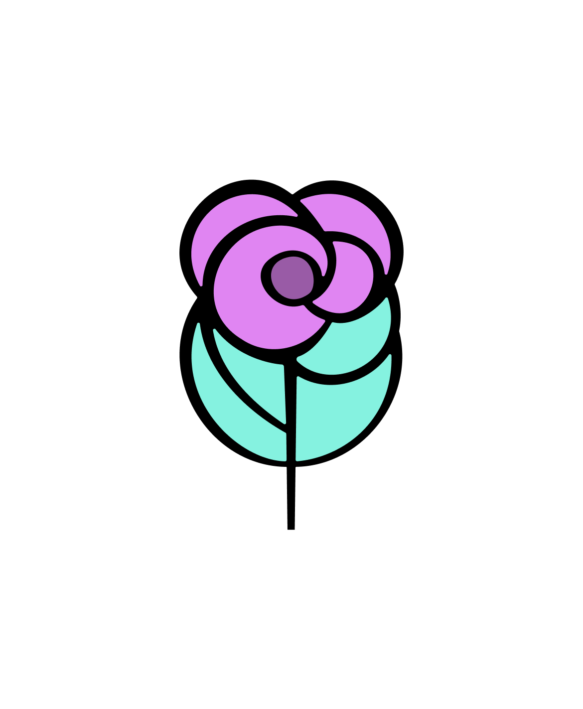

# Ashlee Arrieta Lavado

Proyecto diseñado para Ashlee Arrieta Lavado, Psicóloga Sanitaria.

## Instalación

Para instalar este proyecto, sigue estos pasos:

1. Clona el repositorio:
   ```sh
   git clone https://github.com/DmelladoH/ashleearrietalavado.git
   ```
2. Navega al directorio del proyecto:
   ```sh
   cd ashleearrietalavado
   ```
3. Instala las dependencias:
   ```sh
   pnpm install
   ```

## Uso

Para usar este proyecto, sigue estos pasos:

1. Inicia el servidor de desarrollo:
   ```sh
   pnpm dev
   ```
2. Abre tu navegador y navega a `http://localhost:4321`.

## Tecnologías

- [Astro](https://astro.build/)
- [Tailwind CSS](https://tailwindcss.com/)
- [pnpm](https://pnpm.io/)
